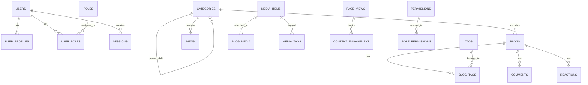
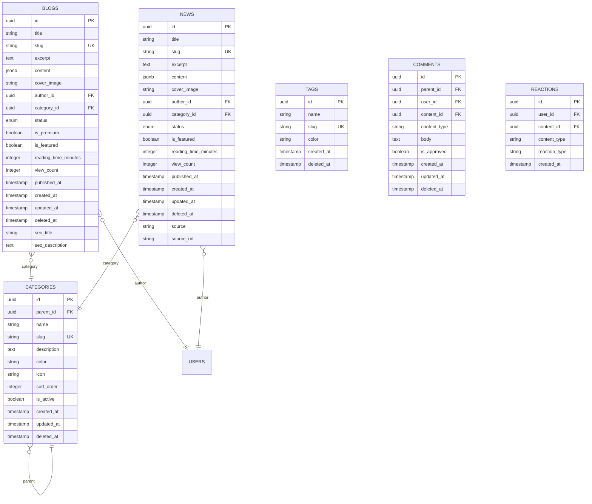
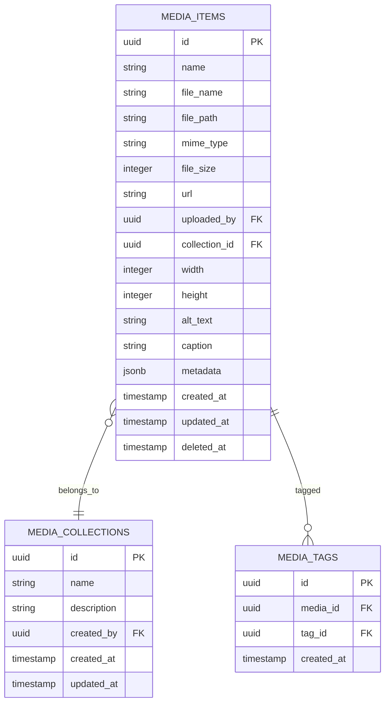

# Budget Ndio Story - PostgreSQL Database Schema Architecture

## Executive Summary

This document defines the comprehensive PostgreSQL database schema architecture for the Budget Ndio Story civic education platform. The architecture follows domain-driven design principles with proper separation of concerns, PostgreSQL best practices, and Supabase compatibility.

---

## 1. Architecture Overview

### 1.1 Design Principles

- **Backward Compatibility**: Preserve existing tables (`blogs`, `categories`, `user_profiles`, `organization_profile`)
- **Domain-Based Organization**: Logical grouping of related tables into domains
- **Standard Fields**: Consistent timestamp, soft delete, status, and audit fields across all tables
- **PostgreSQL Best Practices**: Proper data types, indexes, constraints, and UUID primary keys
- **Future Expansion**: Modular design allowing easy addition of new content types

### 1.2 Proposed Domain Structure

```
├── content          # Content management (blogs, articles, news, categories, tags)
├── users            # User management and profiles
├── media            # Media asset management
├── analytics        # Tracking and analytics
└── shared           # Cross-cutting concerns (audit, settings)
```

---

## 2. Entity-Relationship Diagram

### 2.1 High-Level Domain Relationships



### 2.2 Content Domain Relationships



### 2.3 Users Domain Relationships

```mermaid
erDiagram
    USERS {
        uuid id PK
        string email UK
        string password_hash
        string full_name
        boolean is_active
        boolean email_verified
        timestamp created_at
        timestamp updated_at
    }
    
    USER_PROFILES {
        uuid id PK
        uuid user_id FK UK
        string avatar_url
        text bio
        string location
        string website
        string social_links JSONB
        timestamp created_at
        timestamp updated_at
    }
    
    ROLES {
        uuid id PK
        string name UK
        string description
        string permissions JSONB
        timestamp created_at
    }
    
    USER_ROLES {
        uuid id PK
        uuid user_id FK
        uuid role_id FK
        timestamp assigned_at
        timestamp expires_at
    }
    
    SESSIONS {
        uuid id PK
        uuid user_id FK
        string token
        string ip_address
        string user_agent
        timestamp expires_at
        timestamp created_at
    }
    
    USERS ||--o| USER_PROFILES : has
    USERS ||--o{ USER_ROLES : assigned
    USERS ||--o{ SESSIONS : has
    ROLES ||--o{ USER_ROLES : assigned
```

### 2.4 Media Domain Relationships



### 2.5 Analytics Domain Relationships

```mermaid
erDiagram
    PAGE_VIEWS {
        uuid id PK
        string session_id
        uuid user_id FK
        string path
        string referrer
        string device_type
        string browser
        string os
        string country
        string city
        timestamp viewed_at
    }
    
    CONTENT_ENGAGEMENT {
        uuid id PK
        uuid user_id FK
        uuid content_id FK
        string content_type
        integer time_spent_seconds
        integer scroll_depth
        boolean completed
        string event_type
        timestamp created_at
    }
    
    SEARCH_LOGS {
        uuid id PK
        uuid user_id FK
        string query
        integer results_count
        string filters JSONB
        timestamp searched_at
    }
    
    USER_ACTIVITIES {
        uuid id PK
        uuid user_id FK
        string activity_type
        jsonb metadata
        string ip_address
        timestamp created_at
    }
```

---

## 3. Table Structures

### 3.1 Existing Tables (Backward Compatible)

#### 3.1.1 blogs

| Column | Type | Constraints | Description |
|--------|------|-------------|-------------|
| id | UUID | PK, DEFAULT gen_random_uuid() | Primary key |
| title | VARCHAR(255) | NOT NULL | Blog title |
| slug | VARCHAR(255) | NOT NULL, UNIQUE | URL-friendly slug |
| excerpt | TEXT | | Short description |
| content | JSONB | NOT NULL | {html, plain} structure |
| cover_image | VARCHAR(500) | | Image URL |
| author_id | UUID | FK → auth.users | Author reference |
| category_id | UUID | FK → categories | Category reference |
| status | VARCHAR(20) | NOT NULL, DEFAULT 'draft' | draft, published, archived, review |
| is_premium | BOOLEAN | DEFAULT false | Premium content flag |
| is_featured | BOOLEAN | DEFAULT false | Featured content flag |
| reading_time_minutes | INTEGER | | Estimated reading time |
| view_count | INTEGER | DEFAULT 0 | View counter |
| published_at | TIMESTAMPTZ | | Publication timestamp |
| created_at | TIMESTAMPTZ | NOT NULL, DEFAULT now() | Creation timestamp |
| updated_at | TIMESTAMPTZ | NOT NULL, DEFAULT now() | Last update timestamp |
| seo_title | VARCHAR(70) | | SEO title |
| seo_description | VARCHAR(160) | | SEO description |

#### 3.1.2 categories

| Column | Type | Constraints | Description |
|--------|------|-------------|-------------|
| id | UUID | PK, DEFAULT gen_random_uuid() | Primary key |
| name | VARCHAR(100) | NOT NULL | Category name |
| slug | VARCHAR(100) | NOT NULL, UNIQUE | URL-friendly slug |
| description | TEXT | | Category description |
| color | VARCHAR(7) | | Hex color code |
| icon | VARCHAR(50) | | Icon identifier |
| parent_id | UUID | FK → categories | Self-reference for hierarchy |
| sort_order | INTEGER | DEFAULT 0 | Display ordering |
| is_active | BOOLEAN | DEFAULT true | Active status |
| created_at | TIMESTAMPTZ | NOT NULL, DEFAULT now() | Creation timestamp |
| updated_at | TIMESTAMPTZ | NOT NULL, DEFAULT now() | Last update timestamp |

#### 3.1.3 user_profiles

| Column | Type | Constraints | Description |
|--------|------|-------------|-------------|
| id | UUID | PK, DEFAULT gen_random_uuid() | Primary key |
| user_id | UUID | NOT NULL, UNIQUE, FK → auth.users | User reference |
| avatar_url | VARCHAR(500) | | Profile image URL |
| bio | TEXT | | User biography |
| created_at | TIMESTAMPTZ | NOT NULL, DEFAULT now() | Creation timestamp |
| updated_at | TIMESTAMPTZ | NOT NULL, DEFAULT now() | Last update timestamp |

#### 3.1.4 organization_profile

| Column | Type | Constraints | Description |
|--------|------|-------------|-------------|
| id | UUID | PK, DEFAULT gen_random_uuid() | Primary key |
| organization_name | VARCHAR(255) | NOT NULL | Organization name |
| logo_url | VARCHAR(500) | | Logo image URL |
| description | TEXT | | Organization description |
| tagline | VARCHAR(255) | | Short tagline |
| mission | TEXT | | Mission statement |
| vision | TEXT | | Vision statement |
| contact_email | VARCHAR(255) | | Contact email |
| contact_phone | VARCHAR(50) | | Contact phone |
| website_url | VARCHAR(500) | | Website URL |
| address_line1 | VARCHAR(255) | | Address line 1 |
| address_line2 | VARCHAR(255) | | Address line 2 |
| city | VARCHAR(100) | | City |
| state | VARCHAR(100) | | State/County |
| postal_code | VARCHAR(20) | | Postal code |
| country | VARCHAR(100) | DEFAULT 'Kenya' | Country |
| facebook_url | VARCHAR(500) | | Facebook URL |
| twitter_url | VARCHAR(500) | | Twitter URL |
| instagram_url | VARCHAR(500) | | Instagram URL |
| linkedin_url | VARCHAR(500) | | LinkedIn URL |
| youtube_url | VARCHAR(500) | | YouTube URL |
| founded_year | INTEGER | | Founded year |
| registration_number | VARCHAR(100) | | Registration number |
| tax_id | VARCHAR(100) | | Tax ID |
| created_at | TIMESTAMPTZ | NOT NULL, DEFAULT now() | Creation timestamp |
| updated_at | TIMESTAMPTZ | NOT NULL, DEFAULT now() | Last update timestamp |

### 3.2 New Tables - Content Domain

#### 3.2.1 news

| Column | Type | Constraints | Description |
|--------|------|-------------|-------------|
| id | UUID | PK, DEFAULT gen_random_uuid() | Primary key |
| title | VARCHAR(255) | NOT NULL | News title |
| slug | VARCHAR(255) | NOT NULL, UNIQUE | URL-friendly slug |
| excerpt | TEXT | | Short description |
| content | JSONB | NOT NULL | {html, plain} structure |
| cover_image | VARCHAR(500) | | Image URL |
| author_id | UUID | FK → auth.users | Author reference |
| category_id | UUID | FK → categories | Category reference |
| status | VARCHAR(20) | NOT NULL, DEFAULT 'draft' | draft, published, archived, review |
| is_featured | BOOLEAN | DEFAULT false | Featured news flag |
| reading_time_minutes | INTEGER | | Estimated reading time |
| view_count | INTEGER | DEFAULT 0 | View counter |
| published_at | TIMESTAMPTZ | | Publication timestamp |
| source | VARCHAR(255) | | Original source |
| source_url | VARCHAR(500) | | Source URL |
| created_at | TIMESTAMPTZ | NOT NULL, DEFAULT now() | Creation timestamp |
| updated_at | TIMESTAMPTZ | NOT NULL, DEFAULT now() | Last update timestamp |
| deleted_at | TIMESTAMPTZ | | Soft delete timestamp |

#### 3.2.2 tags

| Column | Type | Constraints | Description |
|--------|------|-------------|-------------|
| id | UUID | PK, DEFAULT gen_random_uuid() | Primary key |
| name | VARCHAR(50) | NOT NULL, UNIQUE | Tag name |
| slug | VARCHAR(50) | NOT NULL, UNIQUE | URL-friendly slug |
| color | VARCHAR(7) | | Hex color code |
| created_at | TIMESTAMPTZ | NOT NULL, DEFAULT now() | Creation timestamp |
| deleted_at | TIMESTAMPTZ | | Soft delete timestamp |

#### 3.2.3 blog_tags (Junction Table)

| Column | Type | Constraints | Description |
|--------|------|-------------|-------------|
| id | UUID | PK, DEFAULT gen_random_uuid() | Primary key |
| blog_id | UUID | NOT NULL, FK → blogs | Blog reference |
| tag_id | UUID | NOT NULL, FK → tags | Tag reference |
| created_at | TIMESTAMPTZ | NOT NULL, DEFAULT now() | Creation timestamp |

#### 3.2.4 news_tags (Junction Table)

| Column | Type | Constraints | Description |
|--------|------|-------------|-------------|
| id | UUID | PK, DEFAULT gen_random_uuid() | Primary key |
| news_id | UUID | NOT NULL, FK → news | News reference |
| tag_id | UUID | NOT NULL, FK → tags | Tag reference |
| created_at | TIMESTAMPTZ | NOT NULL, DEFAULT now() | Creation timestamp |

#### 3.2.5 comments

| Column | Type | Constraints | Description |
|--------|------|-------------|-------------|
| id | UUID | PK, DEFAULT gen_random_uuid() | Primary key |
| parent_id | UUID | FK → comments | Self-reference for threading |
| user_id | UUID | NOT NULL, FK → auth.users | User reference |
| content_id | UUID | NOT NULL | Content reference |
| content_type | VARCHAR(50) | NOT NULL | blog, news |
| body | TEXT | NOT NULL | Comment content |
| is_approved | BOOLEAN | DEFAULT true | Approval status |
| created_at | TIMESTAMPTZ | NOT NULL, DEFAULT now() | Creation timestamp |
| updated_at | TIMESTAMPTZ | NOT NULL, DEFAULT now() | Last update timestamp |
| deleted_at | TIMESTAMPTZ | | Soft delete timestamp |

#### 3.2.6 reactions

| Column | Type | Constraints | Description |
|--------|------|-------------|-------------|
| id | UUID | PK, DEFAULT gen_random_uuid() | Primary key |
| user_id | UUID | NOT NULL, FK → auth.users | User reference |
| content_id | UUID | NOT NULL | Content reference |
| content_type | VARCHAR(50) | NOT NULL | blog, news |
| reaction_type | VARCHAR(20) | NOT NULL | like, love, insightful, helpful |
| created_at | TIMESTAMPTZ | NOT NULL, DEFAULT now() | Creation timestamp |

### 3.3 New Tables - Users Domain

#### 3.3.1 roles

| Column | Type | Constraints | Description |
|--------|------|-------------|-------------|
| id | UUID | PK, DEFAULT gen_random_uuid() | Primary key |
| name | VARCHAR(50) | NOT NULL, UNIQUE | Role name |
| description | TEXT | | Role description |
| permissions | JSONB | DEFAULT '[]' | Permission array |
| created_at | TIMESTAMPTZ | NOT NULL, DEFAULT now() | Creation timestamp |

#### 3.3.2 user_roles

| Column | Type | Constraints | Description |
|--------|------|-------------|-------------|
| id | UUID | PK, DEFAULT gen_random_uuid() | Primary key |
| user_id | UUID | NOT NULL, FK → auth.users | User reference |
| role_id | UUID | NOT NULL, FK → roles | Role reference |
| assigned_at | TIMESTAMPTZ | NOT NULL, DEFAULT now() | Assignment timestamp |
| expires_at | TIMESTAMPTZ | | Expiration timestamp |

#### 3.3.3 permissions

| Column | Type | Constraints | Description |
|--------|------|-------------|-------------|
| id | UUID | PK, DEFAULT gen_random_uuid() | Primary key |
| name | VARCHAR(100) | NOT NULL, UNIQUE | Permission name |
| description | TEXT | | Permission description |
| resource | VARCHAR(50) | NOT NULL | Resource type |
| action | VARCHAR(50) | NOT NULL | Action type |
| created_at | TIMESTAMPTZ | NOT NULL, DEFAULT now() | Creation timestamp |

#### 3.3.4 role_permissions

| Column | Type | Constraints | Description |
|--------|------|-------------|-------------|
| id | UUID | PK, DEFAULT gen_random_uuid() | Primary key |
| role_id | UUID | NOT NULL, FK → roles | Role reference |
| permission_id | UUID | NOT NULL, FK → permissions | Permission reference |
| created_at | TIMESTAMPTZ | NOT NULL, DEFAULT now() | Creation timestamp |

#### 3.3.5 sessions

| Column | Type | Constraints | Description |
|--------|------|-------------|-------------|
| id | UUID | PK, DEFAULT gen_random_uuid() | Primary key |
| user_id | UUID | NOT NULL, FK → auth.users | User reference |
| token | VARCHAR(255) | NOT NULL, UNIQUE | Session token |
| ip_address | VARCHAR(45) | | IP address |
| user_agent | TEXT | | User agent string |
| expires_at | TIMESTAMPTZ | NOT NULL | Expiration timestamp |
| created_at | TIMESTAMPTZ | NOT NULL, DEFAULT now() | Creation timestamp |

### 3.4 New Tables - Media Domain

#### 3.4.1 media_items

| Column | Type | Constraints | Description |
|--------|------|-------------|-------------|
| id | UUID | PK, DEFAULT gen_random_uuid() | Primary key |
| name | VARCHAR(255) | NOT NULL | Display name |
| file_name | VARCHAR(255) | NOT NULL | Original file name |
| file_path | VARCHAR(500) | NOT NULL | Storage path |
| mime_type | VARCHAR(100) | NOT NULL | MIME type |
| file_size | INTEGER | NOT NULL | File size in bytes |
| url | VARCHAR(500) | NOT NULL | Public URL |
| uploaded_by | UUID | FK → auth.users | Uploader reference |
| collection_id | UUID | FK → media_collections | Collection reference |
| width | INTEGER | | Image width |
| height | INTEGER | | Image height |
| alt_text | VARCHAR(255) | | Alt text |
| caption | TEXT | | Caption |
| metadata | JSONB | DEFAULT '{}' | Additional metadata |
| created_at | TIMESTAMPTZ | NOT NULL, DEFAULT now() | Creation timestamp |
| updated_at | TIMESTAMPTZ | NOT NULL, DEFAULT now() | Last update timestamp |
| deleted_at | TIMESTAMPTZ | | Soft delete timestamp |

#### 3.4.2 media_collections

| Column | Type | Constraints | Description |
|--------|------|-------------|-------------|
| id | UUID | PK, DEFAULT gen_random_uuid() | Primary key |
| name | VARCHAR(100) | NOT NULL | Collection name |
| description | TEXT | | Collection description |
| created_by | UUID | FK → auth.users | Creator reference |
| created_at | TIMESTAMPTZ | NOT NULL, DEFAULT now() | Creation timestamp |
| updated_at | TIMESTAMPTZ | NOT NULL, DEFAULT now() | Last update timestamp |

#### 3.4.3 media_tags

| Column | Type | Constraints | Description |
|--------|------|-------------|-------------|
| id | UUID | PK, DEFAULT gen_random_uuid() | Primary key |
| media_id | UUID | NOT NULL, FK → media_items | Media reference |
| tag_id | UUID | NOT NULL, FK → tags | Tag reference |
| created_at | TIMESTAMPTZ | NOT NULL, DEFAULT now() | Creation timestamp |

#### 3.4.4 blog_media

| Column | Type | Constraints | Description |
|--------|------|-------------|-------------|
| id | UUID | PK, DEFAULT gen_random_uuid() | Primary key |
| blog_id | UUID | NOT NULL, FK → blogs | Blog reference |
| media_id | UUID | NOT NULL, FK → media_items | Media reference |
| display_order | INTEGER | DEFAULT 0 | Display order |
| created_at | TIMESTAMPTZ | NOT NULL, DEFAULT now() | Creation timestamp |

### 3.5 New Tables - Analytics Domain

#### 3.5.1 page_views

| Column | Type | Constraints | Description |
|--------|------|-------------|-------------|
| id | UUID | PK, DEFAULT gen_random_uuid() | Primary key |
| session_id | UUID | | Session reference |
| user_id | UUID | FK → auth.users | User reference |
| path | VARCHAR(500) | NOT NULL | Page path |
| referrer | VARCHAR(500) | | Referrer URL |
| device_type | VARCHAR(20) | | mobile, tablet, desktop |
| browser | VARCHAR(50) | | Browser name |
| os | VARCHAR(50) | | Operating system |
| country | VARCHAR(2) | | Country code |
| city | VARCHAR(100) | | City name |
| viewed_at | TIMESTAMPTZ | NOT NULL, DEFAULT now() | View timestamp |

#### 3.5.2 content_engagement

| Column | Type | Constraints | Description |
|--------|------|-------------|-------------|
| id | UUID | PK, DEFAULT gen_random_uuid() | Primary key |
| user_id | UUID | FK → auth.users | User reference |
| content_id | UUID | NOT NULL | Content reference |
| content_type | VARCHAR(50) | NOT NULL | blog, news |
| time_spent_seconds | INTEGER | | Time spent reading |
| scroll_depth | INTEGER | | Scroll percentage |
| completed | BOOLEAN | | Completed reading |
| event_type | VARCHAR(50) | | read, share, save, download |
| created_at | TIMESTAMPTZ | NOT NULL, DEFAULT now() | Creation timestamp |

#### 3.5.3 search_logs

| Column | Type | Constraints | Description |
|--------|------|-------------|-------------|
| id | UUID | PK, DEFAULT gen_random_uuid() | Primary key |
| user_id | UUID | FK → auth.users | User reference |
| query | VARCHAR(255) | NOT NULL | Search query |
| results_count | INTEGER | NOT NULL | Results returned |
| filters | JSONB | | Applied filters |
| searched_at | TIMESTAMPTZ | NOT NULL, DEFAULT now() | Search timestamp |

#### 3.5.4 user_activities

| Column | Type | Constraints | Description |
|--------|------|-------------|-------------|
| id | UUID | PK, DEFAULT gen_random_uuid() | Primary key |
| user_id | UUID | FK → auth.users | User reference |
| activity_type | VARCHAR(50) | NOT NULL | Activity type |
| metadata | JSONB | | Additional data |
| ip_address | VARCHAR(45) | | IP address |
| created_at | TIMESTAMPTZ | NOT NULL, DEFAULT now() | Creation timestamp |

### 3.6 New Tables - Shared Domain

#### 3.6.1 audit_logs

| Column | Type | Constraints | Description |
|--------|------|-------------|-------------|
| id | UUID | PK, DEFAULT gen_random_uuid() | Primary key |
| user_id | UUID | FK → auth.users | User reference |
| action | VARCHAR(50) | NOT NULL | Action performed |
| resource_type | VARCHAR(50) | NOT NULL | Resource type |
| resource_id | UUID | NOT NULL | Resource reference |
| old_values | JSONB | | Previous values |
| new_values | JSONB | | New values |
| ip_address | VARCHAR(45) | | IP address |
| user_agent | TEXT | | User agent |
| created_at | TIMESTAMPTZ | NOT NULL, DEFAULT now() | Creation timestamp |

#### 3.6.2 api_keys

| Column | Type | Constraints | Description |
|--------|------|-------------|-------------|
| id | UUID | PK, DEFAULT gen_random_uuid() | Primary key |
| name | VARCHAR(100) | NOT NULL | Key name |
| key_hash | VARCHAR(255) | NOT NULL, UNIQUE | Hashed key value |
| user_id | UUID | NOT NULL, FK → auth.users | Owner reference |
| permissions | JSONB | DEFAULT '[]' | API permissions |
| expires_at | TIMESTAMPTZ | | Expiration timestamp |
| last_used_at | TIMESTAMPTZ | | Last used timestamp |
| is_active | BOOLEAN | DEFAULT true | Active status |
| created_at | TIMESTAMPTZ | NOT NULL, DEFAULT now() | Creation timestamp |

#### 3.6.3 settings

| Column | Type | Constraints | Description |
|--------|------|-------------|-------------|
| id | UUID | PK, DEFAULT gen_random_uuid() | Primary key |
| key | VARCHAR(100) | NOT NULL, UNIQUE | Setting key |
| value | JSONB | NOT NULL | Setting value |
| description | TEXT | | Setting description |
| is_public | BOOLEAN | DEFAULT false | Public visibility |
| created_at | TIMESTAMPTZ | NOT NULL, DEFAULT now() | Creation timestamp |
| updated_at | TIMESTAMPTZ | NOT NULL, DEFAULT now() | Last update timestamp |

---

## 4. Index Strategy

### 4.1 Primary Indexes (Auto-created)

- All primary keys (UUID) have default B-tree indexes

### 4.2 Foreign Key Indexes

| Table | Column | Index Name | Purpose |
|-------|--------|------------|----------|
| blogs | author_id | idx_blogs_author_id | Author lookups |
| blogs | category_id | idx_blogs_category_id | Category filtering |
| blogs | status | idx_blogs_status | Status filtering |
| blogs | published_at | idx_blogs_published_at | Published date sorting |
| news | author_id | idx_news_author_id | Author lookups |
| news | category_id | idx_news_category_id | Category filtering |
| news | status | idx_news_status | Status filtering |
| news | published_at | idx_news_published_at | Published date sorting |
| comments | content_id | idx_comments_content_id | Content comments |
| comments | user_id | idx_comments_user_id | User comments |
| reactions | content_id | idx_reactions_content_id | Content reactions |
| reactions | user_id | idx_reactions_user_id | User reactions |
| user_profiles | user_id | idx_user_profiles_user_id | User profile lookups |
| user_roles | user_id | idx_user_roles_user_id | User roles |
| user_roles | role_id | idx_user_roles_role_id | Role users |
| media_items | uploaded_by | idx_media_items_uploaded_by | User uploads |
| media_items | collection_id | idx_media_items_collection_id | Collection items |
| page_views | user_id | idx_page_views_user_id | User page history |
| page_views | path | idx_page_views_path | Path analytics |
| page_views | viewed_at | idx_page_views_viewed_at | Time-based analytics |
| content_engagement | content_id | idx_content_engagement_content_id | Content analytics |
| search_logs | user_id | idx_search_logs_user_id | User search history |
| search_logs | searched_at | idx_search_logs_searched_at | Time-based search analytics |

### 4.3 Unique Indexes

| Table | Column(s) | Index Name | Purpose |
|-------|-----------|------------|---------|
| blogs | slug | idx_blogs_slug_unique | URL uniqueness |
| news | slug | idx_news_slug_unique | URL uniqueness |
| categories | slug | idx_categories_slug_unique | URL uniqueness |
| tags | name | idx_tags_name_unique | Tag uniqueness |
| tags | slug | idx_tags_slug_unique | URL uniqueness |
| user_profiles | user_id | idx_user_profiles_user_id_unique | One profile per user |
| sessions | token | idx_sessions_token_unique | Session uniqueness |

### 4.4 Full-Text Search Indexes

| Table | Column(s) | Index Name | Index Type |
|-------|-----------|------------|-------------|
| blogs | title, excerpt, plain_content | idx_blogs_fts | GIN |
| news | title, excerpt, plain_content | idx_news_fts | GIN |
| categories | name, description | idx_categories_fts | GIN |
| comments | body | idx_comments_fts | GIN |

### 4.5 Composite Indexes

| Table | Column(s) | Index Name | Purpose |
|-------|-----------|------------|---------|
| blogs | status, published_at | idx_blogs_status_published | Published content |
| blogs | category_id, status | idx_blogs_category_status | Category filtering |
| news | status, published_at | idx_news_status_published | Published news |
| news | category_id, status | idx_news_category_status | Category filtering |
| page_views | user_id, viewed_at | idx_page_views_user_time | User activity |
| content_engagement | content_type, created_at | idx_engagement_type_time | Engagement analytics |

---

## 5. Constraints

### 5.1 Check Constraints

```sql
-- Blog status
ALTER TABLE blogs 
ADD CONSTRAINT chk_blogs_status 
CHECK (status IN ('draft', 'published', 'archived', 'review'));

-- News status
ALTER TABLE news 
ADD CONSTRAINT chk_news_status 
CHECK (status IN ('draft', 'published', 'archived', 'review'));

-- Reaction types
ALTER TABLE reactions 
ADD CONSTRAINT chk_reactions_type 
CHECK (reaction_type IN ('like', 'love', 'insightful', 'helpful'));

-- Device types
ALTER TABLE page_views 
ADD CONSTRAINT chk_device_type 
CHECK (device_type IN ('mobile', 'tablet', 'desktop'));

-- Content types for polymorphic relations
ALTER TABLE comments 
ADD CONSTRAINT chk_content_type 
CHECK (content_type IN ('blog', 'news'));

ALTER TABLE reactions 
ADD CONSTRAINT chk_reaction_content_type 
CHECK (content_type IN ('blog', 'news'));

ALTER TABLE content_engagement 
ADD CONSTRAINT chk_engagement_content_type 
CHECK (content_type IN ('blog', 'news'));
```

### 5.2 Unique Constraints

| Table | Constraint Name | Columns |
|-------|----------------|---------|
| blogs | uk_blogs_slug | slug |
| news | uk_news_slug | slug |
| categories | uk_categories_slug | slug |
| tags | uk_tags_name | name |
| tags | uk_tags_slug | slug |
| user_profiles | uk_user_profiles_user_id | user_id |
| sessions | uk_sessions_token | token |
| api_keys | uk_api_keys_key_hash | key_hash |
| settings | uk_settings_key | key |

### 5.3 Foreign Key Constraints

All foreign key relationships follow Supabase conventions with `ON DELETE` and `ON UPDATE` actions:

| Child Table | Parent Table | FK Column | On Delete | On Update |
|-------------|--------------|------------|-----------|-----------|
| blogs | auth.users | author_id | SET NULL | CASCADE |
| blogs | categories | category_id | SET NULL | CASCADE |
| categories | categories | parent_id | SET NULL | CASCADE |
| news | auth.users | author_id | SET NULL | CASCADE |
| news | categories | category_id | SET NULL | CASCADE |
| blog_tags | blogs | blog_id | CASCADE | CASCADE |
| blog_tags | tags | tag_id | CASCADE | CASCADE |
| news_tags | news | news_id | CASCADE | CASCADE |
| news_tags | tags | tag_id | CASCADE | CASCADE |
| comments | auth.users | user_id | CASCADE | CASCADE |
| comments | comments | parent_id | CASCADE | CASCADE |
| reactions | auth.users | user_id | CASCADE | CASCADE |
| user_profiles | auth.users | user_id | CASCADE | CASCADE |
| user_roles | auth.users | user_id | CASCADE | CASCADE |
| user_roles | roles | role_id | CASCADE | CASCADE |
| role_permissions | roles | role_id | CASCADE | CASCADE |
| role_permissions | permissions | permission_id | CASCADE | CASCADE |
| sessions | auth.users | user_id | CASCADE | CASCADE |
| media_items | auth.users | uploaded_by | SET NULL | CASCADE |
| media_items | media_collections | collection_id | SET NULL | CASCADE |
| media_collections | auth.users | created_by | SET NULL | CASCADE |
| media_tags | media_items | media_id | CASCADE | CASCADE |
| media_tags | tags | tag_id | CASCADE | CASCADE |
| blog_media | blogs | blog_id | CASCADE | CASCADE |
| blog_media | media_items | media_id | CASCADE | CASCADE |
| page_views | auth.users | user_id | SET NULL | CASCADE |
| content_engagement | auth.users | user_id | SET NULL | CASCADE |
| search_logs | auth.users | user_id | SET NULL | CASCADE |
| user_activities | auth.users | user_id | SET NULL | CASCADE |
| audit_logs | auth.users | user_id | SET NULL | CASCADE |
| api_keys | auth.users | user_id | CASCADE | CASCADE |

---

## 6. Migration File Naming Convention

### 6.1 Naming Format

```
YYYYMMDDHHMMSS_<action>_<description>.sql
```

### 6.2 Action Prefixes

| Prefix | Description |
|--------|-------------|
| `create` | Create new table |
| `alter` | Modify existing table |
| `drop` | Delete table |
| `add` | Add column or constraint |
| `remove` | Remove column or constraint |
| `seed` | Insert seed data |
| `enable` | Enable feature (e.g., RLS) |
| `disable` | Disable feature |

### 6.3 Example Migration Files

```
20240215080000_create_schema_domains.sql
20240215080100_create_tables_content.sql
20240215080200_create_tables_users.sql
20240215080300_create_tables_media.sql
20240215080400_create_tables_analytics.sql
20240215080500_create_tables_shared.sql
20240215080600_create_indexes_content.sql
20240215080700_create_indexes_users.sql
20240215080800_create_indexes_performance.sql
20240215080900_add_check_constraints.sql
20240215081000_enable_rls_policies.sql
20240215081100_seed_default_data.sql
```

---

## 7. Seed Data Requirements

### 7.1 Required Seed Data

#### 7.1.1 Default Roles

| Name | Description | Permissions |
|------|-------------|-------------|
| admin | Full system access | All permissions |
| editor | Content management | create, read, update, delete content |
| author | Create content | create, read, update own content |
| subscriber | Basic access | read public content |
| moderator | Comment management | manage comments, reactions |

#### 7.1.2 Default Permissions

```json
[
  { "resource": "blogs", "actions": ["create", "read", "update", "delete", "publish"] },
  { "resource": "news", "actions": ["create", "read", "update", "delete", "publish"] },
  { "resource": "categories", "actions": ["create", "read", "update", "delete"] },
  { "resource": "tags", "actions": ["create", "read", "update", "delete"] },
  { "resource": "comments", "actions": ["create", "read", "update", "delete", "approve"] },
  { "resource": "media", "actions": ["upload", "read", "delete"] },
  { "resource": "users", "actions": ["create", "read", "update", "delete", "assign_role"] },
  { "resource": "analytics", "actions": ["read"] },
  { "resource": "settings", "actions": ["read", "update"] }
]
```

#### 7.1.3 Default Categories

| Name | Slug | Color | Description |
|------|------|-------|-------------|
| Budget Reports | budget-reports | #1E40AF | In-depth budget analysis |
| News | news | #DC2626 | Latest news and updates |
| Insights | insights | #7C3AED | Data-driven insights |
| Learn | learn | #059669 | Educational content |
| County | county | #D97706 | County-specific content |
| Youth | youth | #EC4899 | Youth-focused content |
| Action | action | #EF4444 | Call to action campaigns |

#### 7.1.4 Default Tags

| Name | Slug | Color |
|------|------|-------|
| Breaking | breaking | #EF4444 |
| Analysis | analysis | #3B82F6 |
| Data | data | #10B981 |
| Education | education | #8B5CF6 |
| Youth | youth | #EC4899 |
| Healthcare | healthcare | #F59E0B |
| Education | education-sector | #06B6D4 |
| Infrastructure | infrastructure | #6366F1 |
| Agriculture | agriculture | #84CC16 |
| Transparency | transparency | #14B8A6 |

#### 7.1.5 Default Settings

| Key | Value | Public |
|-----|-------|--------|
| site_name | "Budget Ndio Story" | true |
| site_description | "Follow the Budget. Find the Story." | true |
| posts_per_page | 10 | true |
| enable_comments | true | true |
| enable_reactions | true | true |
| require_approval | false | false |
| max_upload_size | 10485760 | false |
| allowed_file_types | ["image/jpeg", "image/png", "image/webp", "application/pdf"] | false |

---

## 8. Supabase-Specific Features

### 8.1 Row Level Security (RLS)

All tables should have RLS enabled with appropriate policies:

#### 8.1.1 Public Read Tables
- blogs (published only)
- news (published only)
- categories (active only)
- tags
- media_items (public collection)

#### 8.1.2 Authenticated Write Tables
- comments
- reactions
- user_profiles

#### 8.1.3 Role-Based Access Tables
- All admin tables require editor+ role

### 8.2 Storage Buckets

| Bucket Name | Description | Public |
|-------------|-------------|--------|
| blog-covers | Blog cover images | true |
| news-covers | News cover images | true |
| avatars | User profile pictures | true |
| media | General media library | true |
| documents | PDF documents | true |

### 8.3 Database Functions

Required helper functions:

```sql
-- Get published content
CREATE OR REPLACE FUNCTION get_published_blogs()
RETURNS SETOF blogs
LANGUAGE sql
STABLE
AS $$
  SELECT * FROM blogs 
  WHERE status = 'published' 
  AND published_at <= now()
  AND deleted_at IS NULL;
$$;

-- Get active categories
CREATE OR REPLACE FUNCTION get_active_categories()
RETURNS SETOF categories
LANGUAGE sql
STABLE
AS $$
  SELECT * FROM categories 
  WHERE is_active = true 
  AND deleted_at IS NULL;
$$;

-- Calculate reading time
CREATE OR REPLACE FUNCTION calculate_reading_time(content_text TEXT)
RETURNS INTEGER
LANGUAGE sql
STABLE
AS $$
  SELECT CEIL(array_length(string_to_array(content_text, ' '), 1) / 200::INTEGER);
$$;
```

---

## 9. Implementation Priority

### Phase 1: Core Content (UI Already Built)
1. Create schema structure
2. Migrate existing tables (blogs, categories, user_profiles, organization_profile)
3. Add news table
4. Add tags and tag associations
5. Add comments and reactions
6. Create indexes
7. Add RLS policies

### Phase 2: User Management
1. Create roles and permissions
2. Create user_roles
3. Create sessions
4. Seed default roles

### Phase 3: Media Management
1. Create media tables
2. Configure storage buckets
3. Add media RLS policies

### Phase 4: Analytics
1. Create analytics tables
2. Create tracking functions

### Phase 5: Shared Infrastructure
1. Create audit logs
2. Create API keys
3. Create settings table
4. Seed default settings

---

## 10. Summary

This database schema architecture provides:

- **Scalability**: Domain-based organization allows horizontal scaling
- **Flexibility**: JSONB fields for metadata and content structures
- **Performance**: Strategic indexes for common query patterns
- **Security**: RLS policies, audit trails, and role-based access
- **Maintainability**: Standard naming conventions and consistent field structures
- **Future-Proof**: Modular design for easy extension

The architecture is optimized for:
- Supabase integration
- Next.js frontend
- High read traffic (civic education content)
- User engagement tracking
- Content moderation workflows
